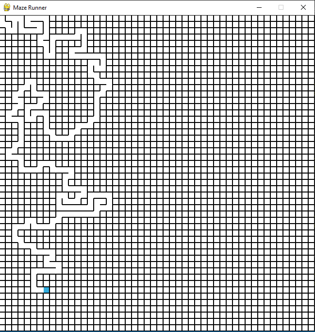
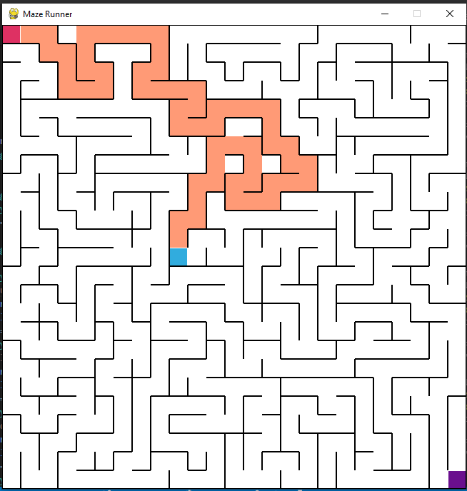
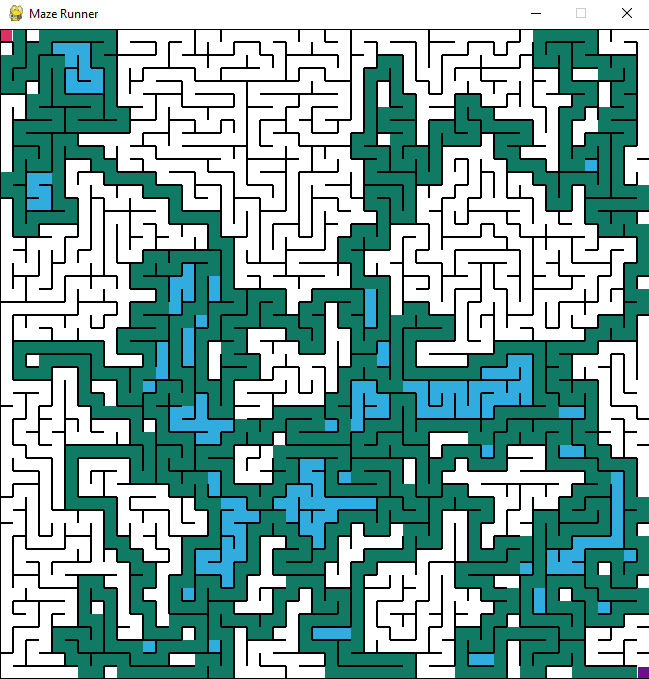
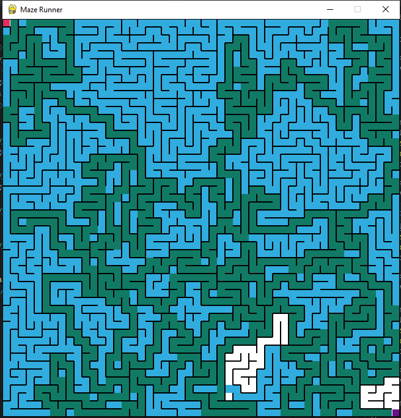

 

# Maze-Generator-with-Randomized-DFS
A Pygame application which generates mazes using randomized DFS (Depth-First-Search)-(Iterative implementation).

Randomized-DFS: This algorithm, also known as the "recursive backtracker" algorithm, is a randomized version of the depth-first search algorithm. Frequently implemented with a stack, this approach is one of the simplest ways to generate a maze.

## Features:
* After the maze has been created, the user can play it and try to solve it if they want using the arrow keys.
* User can switch to easy mode or hard mode using the letters 'e' or 'h'. Easy mode will leave them with 25x25 maze while hardmode contains 50x50 maze.
* User can also let the program solve the maze with either DFS or BFS.

## How to Use:
<pre>
 To create the maze   - Press space bar  
 To play              - Use arrow keys ( ↑, ↓, →, ← )  
 Switch to hard mode  - Press 'h' key  
 Switch back to easy
 Mode                 - Press 'e' key  
 To solve it with DFS - press the left control key  
 To solve it with BFS - press the right control key  
 To clear the visualisation part - press the 'c' key.
</pre>
* (note: If you want to see the process of creating the maze in a slower speed then feel free to change the speed - "time.sleep(0.05)" in line 228 ('dfs_maze_build' function).
* Choose the mode first (easy or hard) before pressing the space bar.(default is easy mode)

## Demo:
* 50x50 grid maze creation:  

* User solving the 25x25 maze

* Solving the maze using DFS 

* Solving the maze using BFS 

